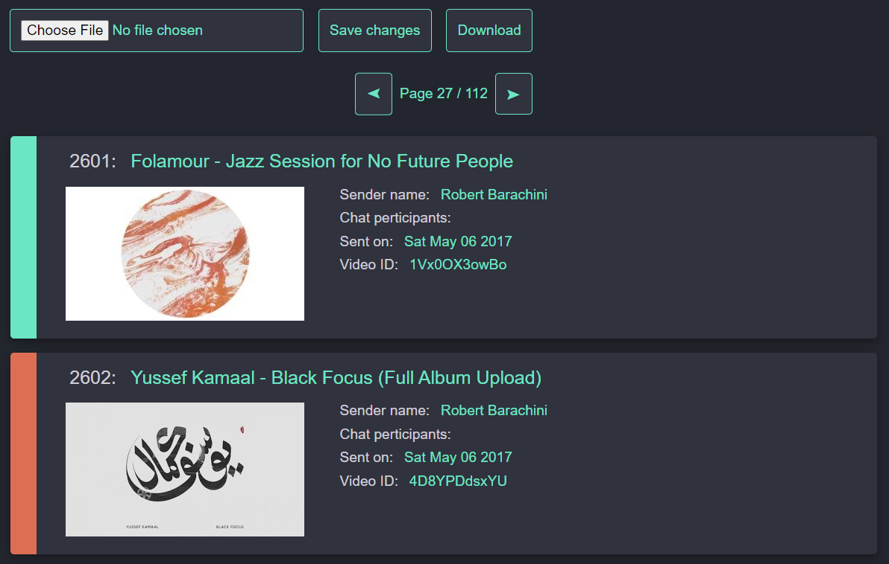

# Intro

Ever wanted to view old `YouTube` videos and songs you shared with your friends via `Facebook Messenger` over the years but don't know how? Well you're in luck as this script / utility allows you to do just that and with ease (relatively speaking of course). Just follow the instructions and you should be able to browse a dynamically generated site, containing the `YouTube links` 🔗 (`chronologically sorted`, with `thumbnails` 🖼️ and other data as well) in no time (waiting for the `Facebook archive` to be ready for download can take a couple of days though)! 

# Instructions

0. Download a copy of your `Facebook data` (in `JSON` format). 
1. Obtain a `YouTube Data API v3` key and put it into a file named `youtube_api_key` in the project root.
2. Enter the path to your Facebook data archives into a file named `root_folder` in the project root. Recommended path within the unzipped archive: `...\messages\inbox`.
3. Run `python src/LinksParser.py` (located in `src`) - if all goes well, a file named `processed_youtubedata_thumbnails.json` will be generated in the `processed` directory.
4. Open the `LinkPicker.html` file in your browser of choice (originally tested with Google Chrome).
5. Click the `Choose File` button and choose the `processed_youtubedata_thumbnails.json` file.

# Usage and tips

## So many links!

If you see that the first step of the pipeline in `LinksParser.py` produces more than 10.000 link object, you may need to repeat the second stage of the whole process more than once, because the default rate limit for `YouTube Data API v3` is 10k requests per day. If you just rerun the program the next day (when the rate limit resets) you should be fine, because the program usually knows where it left off and picks up most suitable pregenerated `JSON` object.

Generating about 10k `link objects` takes roughly `20 seconds`, fetching the `YouTube data` can take about `20-30 minutes` and fetching available `thumbnails` can take up to `15 minutes`.

## LinkPicker.html

The site is dynamically generated based on the generated `JSON` file you choose. As you can imagine, checking out 10k+ links in one sitting could be a hassle. That's why I've decided to paginate it and store the last page visited so you can always continue where you left off. Loading the file each time you start the browser is not necessary as it is cached in the `IndexedDB`.

As you can see by the two colors on the left, you can `toggle` each link item by clicking on the colored section. Green-ish tint means that the link is selected. This was meant for later stage of picking just the links you wanted to save, but as it turns out you may want to choose a different video / song which is newer and has better quality than the one you sent or received long ago. That's why it's usually best practice to click on the link name, which opens the `YouTube video` in a new tab. Clicking on the thumbnail opens an `iframe`, which plays the `embeded video`. If you've made changes (toggled link items), you can save the changes by clicking on the Save chenges button. If you wish to download the edited `JSON` file, you can click the `Download` button. If you accidentally want to close the tab without saving changes, you will be prompted to save progress as a failsafe. You can adjust the number of link items per page in the `LinkPicker.js` file.

`Best practices` / quickest workflow when checking links: `Ctrl + click` all of the links you want to look into, look at each and choose whether or not you want to save it for later or find a better quality of the same video / song. Once you're done with a video, just `ctrl + w` to close the tab and move on. Once you've closed all of the previouly opened tabs, return to the one with `LinkPicker` opened in it and continue with the next page.

Have fun exploring all of the old `YouTube` links you've sent between friends. In case you want to archive certain videos close to your `❤`, you can check out my [Lyre](https://github.com/RobertBarachini/Lyre "Lyre project GitHub") project which is basically a `youtube-dl` frontent.
	
If you have any questions or suggestions, please contact me.

Signing off 🤖